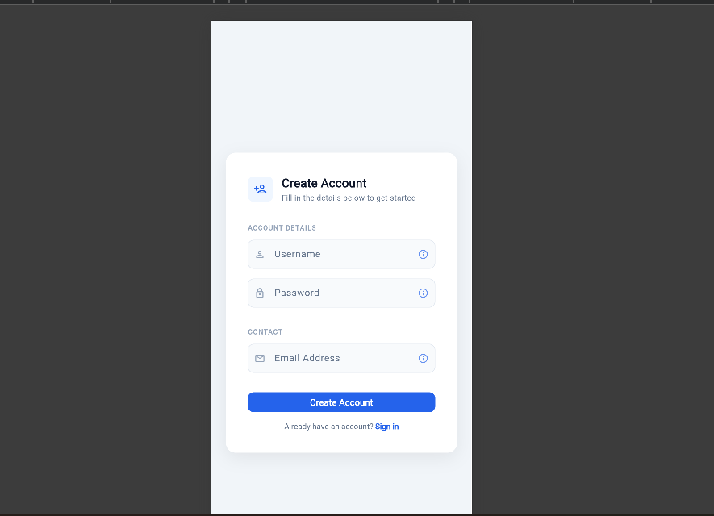

# Tooltip Widget Demo

This is a Flutter widget that shows a short contextual message when a user hovers or long-presses an element as a way of guiding users.


##  What This Demo Does

This app simulates a real-world account sign-up form where each field has an info icon. Hovering or long-pressing the icon triggers a Tooltip that explains the field's requirements, exactly how production apps like Google Forms guide users.


## How to Run

```bash
# 1. Clone the repo
git clone https://github.com/YOUR_USERNAME/tooltip-demo.git
cd tooltip-demo

# 2. Get dependencies
flutter pub get

# 3. Run (Chrome recommended)
flutter run -d chrome
```


##  Three Tooltip Properties Demonstrated

| # | Property | What It Does | Where in the Demo |
|---|---|---|---|
| 1 | `message` | Sets the text shown inside the tooltip bubble | All three fields |
| 2 | `preferBelow` | `true` = bubble appears below; `false` = above | Username (below) vs Password (above) |
| 3 | `decoration` | Styles the tooltip box (color, radius, shadow) | Email field — dark navy custom style |

### Code snapshot
```dart
Tooltip(
  message: 'Must be 6–20 characters.',  
  preferBelow: false,                 
  decoration: BoxDecoration(             
    color: Color(0xFF1E3A5F),
    borderRadius: BorderRadius.circular(10),
  ),
  child: Icon(Icons.info_outline),
)
```

##  Screenshot




